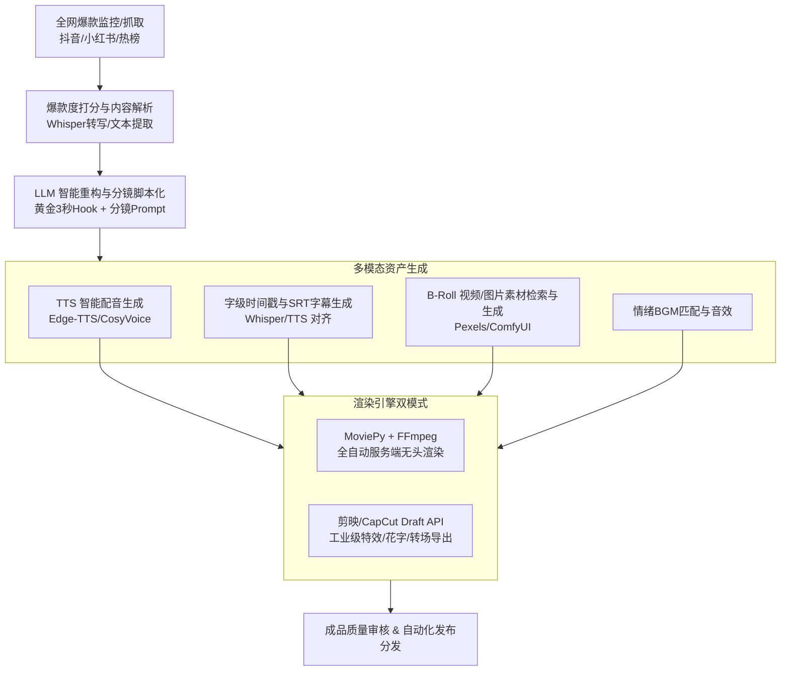

# 全自动爆款挖掘与短视频生成流水线系统 (AI Traffic Pipeline)
## 系统架构与开发设计文档 (System Architecture & Technical Design)

---

## 1. 系统概述 (System Overview)

本系统旨在构建一套**从全网爆款挖掘到短视频成品全自动输出的一体化内容生产流水线**。系统解决传统自媒体创作者在“选题耗时、文案卡壳、配音找素材费劲、剪辑重复繁琐”等痛点，通过结合**数据采集 + LLM 认知智能 + 多模态语音合成 + 自动化视频渲染工程**，实现低成本、高效率、规模化的高质量短视频生产。



---

## 2. 核心功能架构与模块设计 (Module Design)

系统整体划分为 **五大核心子系统**：

### 2.1 模块一：全网爆款挖掘与解析引擎 (Trend Ingestion & Mining)
* **目标**：自动监测过去 24h 内各平台点赞、转发高增长的文案与视频。
* **主要功能**：
  1. **多数据源聚合接入**：
     - 热点榜单监控（知乎、微博热搜、今日头条、B站日榜）。
     - 垂直社媒抓取（抖音热门挑战/文案榜、小红书爆款图文/笔记）。
  2. **爆款度评估打分算法 (Virality Scoring)**：
     - 计算综合爆发指数：$$S = \alpha \cdot \frac{\text{Likes}}{\text{Hours}} + \beta \cdot \frac{\text{Comments}}{\text{Likes}} + \gamma \cdot \text{ShareRatio}$$
  3. **多模态内容提取**：
     - 短视频音轨一键提取 + 离线 Faster-Whisper 转写为原版台词。
     - 封面、文案标签、话题 Tag、评论区高赞金句解析。

### 2.2 模块二：大模型文案重塑与分镜脚本生成引擎 (LLM Creative & Scripting)
* **目标**：将爆款核心逻辑与框架保留，去同质化重写，并输出结构化视频分镜脚本。
* **主要功能**：
  1. **爆款结构骨架拆解与套用**：
     - 黄金 3 秒 Hook（提出反直觉观点 / 悬念 / 痛点发问）。
     - 中段展开（3 个认知点 / 故事反转 / 痛点放大）。
     - 尾部 CTA（行动号召 / 互动引导 / 引导关注）。
  2. **结构化 JSON 分镜输出 (Structured Output)**：
     - 将输出规范为时间轴列表：
       ```json
       {
         "title": "为什么自律的人都起不来床？",
         "style": "干货幽默风",
         "bgm_genre": "upbeat_lofi",
         "scenes": [
           {
             "scene_id": 1,
             "duration_est": 3.5,
             "voiceover": "很多人以为成功靠早起，但科学告诉你，你可能只是在自残！",
             "visual_prompt": "alarm clock ringing angrily, modern bedroom morning, dynamic 4k",
             "asset_keywords": ["alarm clock", "wake up tired"],
             "caption_highlight": ["成功靠早起", "科学告诉你在自残"],
             "transition": "zoom_in"
           }
         ]
       }
       ```

### 2.3 模块三：多模态音视资产生成引擎 (Asset & Audio Engine)
* **目标**：全自动根据分镜脚本生产高质量旁白音频、精准字幕和视觉素材。
* **主要功能**：
  1. **TTS 旁白合成 (TTS Engine)**：
     - 支持 Edge-TTS (高质量免费预设) 及本地/API 声音克隆 (如 CosyVoice / GPT-SoVITS / Fish Audio)。
     - 自动语速调节、停顿标注与语气修饰。
  2. **精确字级时间戳与字幕生成 (Caption Timing)**：
     - 通过 TTS 返回的 Word Boundary 或通过 Faster-Whisper 强制对齐，输出精确到毫秒的 `.srt` / 字级高亮数据。
  3. **素材自动检索与生成 (Asset Sourcing)**：
     - **免费商用图库检索**：Pexels / Pixabay API 自动根据 `asset_keywords` 下载 1080x1920 竖屏 4K 视频/高清图片。
     - **AI 生图兜底**：若关键词匹配度低，自动调用 ComfyUI / SDXL / Midjourney API 生成精准主题配图。
  4. **动态背景音乐库 (Dynamic BGM Engine)**：
     - 预置不同情绪类别（悬疑反转、快节奏干货、温暖治愈、震撼史诗）。
     - 音量自适应 Ducking：有人声时 BGM 自动压低至 -20dB，间歇时平滑恢复。

### 2.4 模块四：自动化视频渲染与合成引擎 (Video Compositor Engine)
* **目标**：双轨制支持跨平台轻量快速渲染与剪映级工业级特效导出。
* **渲染方案一：MoviePy + FFmpeg (极速无头自动化)**：
  - 纯 Python 代码控制，适合 Linux 无头服务器部署。
  - 支持动态缩放（Ken Burns Effect）、模糊背景填充（9:16 适配）、自适应花字与双行字幕居中。
* **渲染方案二：pyJianYing / CapCut Draft API (专业级剪映自动化)**：
  - 直接生成剪映项目工程文件 (`draft_content.json`)。
  - 自动导入预设特效、热门花字气泡、丝滑转场动画、音效（Bip、Swoosh、Pop），一键调用剪映后台导出，质感拉满。

### 2.5 模块五：工作流编排与控制台 (Pipeline Orchestration & Control UI)
* **架构选型**：基于 **LangGraph** 状态机编排整个生成周期。
* **人机协同机制 (Human-in-the-loop)**：
  - 支持全自动流水线无人值守模式。
  - 支持“半自动微调模式”：文案生成后暂停推送 WebUI，人类创作者确认/修改脚本后，再一键流水线合成视频。

---

## 3. 技术选型与技术栈清单 (Tech Stack)

| 层次 | 技术组件 / 库 | 用途说明 |
| :--- | :--- | :--- |
| **基础语言与环境** | Python 3.10+ | 主流 AI 与多媒体处理生态 |
| **工作流状态编排** | LangGraph / Pydantic | 节点状态转移、失败重试、人机回退 |
| **大语言模型层** | OpenAI / DeepSeek / Claude / Qwen | 爆款分析、文案改写、分镜结构化输出 |
| **数据采集与转写** | Requests / Playwright / Faster-Whisper | 平台监控与视频音频一键转文字 |
| **语音合成 (TTS)** | Edge-TTS / CosyVoice / Fish Audio | 自然流利情感旁白生成 |
| **素材检索与处理** | Pexels API / Pillow / OpenCV | 免版权商用视频下载与图像智能居中裁剪 |
| **视频渲染与合成** | MoviePy v2.x / FFmpeg / pyJianYing | 自动化视频剪辑、滤镜、贴片与音视频合成 |
| **Web 管理与审查界面** | FastAPI + Streamlit / Vue3 + TailwindCSS | 任务看板、素材预览、参数配置与一键生成 |

---

## 4. 核心数据结构设计 (Data Contracts)

### 4.1 爆款素材元数据结构 (`RawTopicItem`)
```python
from pydantic import BaseModel, Field
from typing import List, Optional

class RawTopicItem(BaseModel):
    id: str
    source_platform: str  # "douyin" | "xiaohongshu" | "weibo" | "bilibili"
    title: str
    raw_content: str
    video_url: Optional[str] = None
    like_count: int
    comment_count: int
    share_count: int
    hot_score: float
    captured_at: str
```

### 4.2 分镜影视脚本协议 (`VideoProjectScript`)
```python
from pydantic import BaseModel, Field
from typing import List

class SceneItem(BaseModel):
    scene_index: int
    voiceover_text: str = Field(description="该分镜旁白口播文本")
    visual_keywords: List[str] = Field(description="用于素材检索的英文/中文关键词")
    image_prompt: Optional[str] = Field(description="若需AI生图的详细描述词")
    transition: str = Field(default="fade", description="转场效果: fade/slide/zoom")
    duration: Optional[float] = None  # 由 TTS 生成后回填

class VideoProjectScript(BaseModel):
    project_id: str
    title: str
    topic_summary: str
    tone_style: str  # "干货" | "故事" | "反转"
    bgm_type: str
    scenes: List[SceneItem]
    tags: List[str]
```

---

## 5. 项目工程目录规划 (Project Layout)

```text
traffic_pipeline/
├── config/                  # 配置文件（API Keys, 预设音色, 默认参数）
│   └── settings.yaml
├── core/
│   ├── orchestrator.py      # LangGraph 主流程状态机
│   └── state.py             # 管道状态 PipelineState 定义
├── crawlers/                # 爆款采集与解析模块
│   ├── douyin_spider.py
│   ├── xhs_spider.py
│   └── hot_board.py
├── writers/                 # 文案改写与分镜拆解模块
│   ├── prompts.py           # 爆款 Prompt 模板库 (Hook, CTA, 黄金开头)
│   └── script_generator.py  # LLM 结构化输出分镜脚本
├── audio/                   # 语音与音效引擎
│   ├── tts_engine.py        # Edge-TTS / CosyVoice 适配器
│   └── srt_aligner.py       # 时间戳对齐与字幕生成
├── media/                   # 素材管理与视觉生成
│   ├── pexels_client.py     # 免版权视频素材自动搜索与下载
│   ├── ai_image_gen.py      # ComfyUI / SD 备用生图
│   └── bgm_manager.py       # BGM 情绪匹配与音量自适应 Ducking
├── compositors/             # 视频渲染合成器
│   ├── moviepy_renderer.py  # MoviePy 服务端无头流水线
│   └── jianying_draft.py    # 剪映工程 Draft 生成器
├── web_ui/                  # 人机协同审查与仪表盘 (Streamlit / FastAPI)
│   └── app.py
├── output/                  # 生成的中间素材与最终成品 MP4
│   ├── audio/
│   ├── video_assets/
│   └── final/
├── docs/                    # 详细架构与开发文档
│   ├── DESIGN_AND_DEVELOPMENT.md
│   └── FUNCTIONAL_SPEC.md
├── requirements.txt
└── main.py                  # CLI 入口
```

---

## 6. 实施路线与里程碑规划 (Implementation Roadmap)

1. **Phase 1 (基础骨架与单点贯通)**:
   - 跑通 `Edge-TTS` 语音生成与精准毫秒字幕导出。
   - 实现 `MoviePy` 基础渲染器：多段图片/视频片段拼接 + 旁白对齐 + 居中自适应字幕 + BGM 混音。
2. **Phase 2 (智能文案与素材检索)**:
   - 接入 LLM 爆款改写与结构化分镜 JSON 输出。
   - 接入 Pexels 免费素材库 API，实现按分镜关键词自动拉取 9:16 高清视频素材。
3. **Phase 3 (爆款爬虫与全流程编排)**:
   - 实现多源热榜抓取与爆款视频转写。
   - 基于 LangGraph 串联全流程，支持一键从热点到成品视频。
4. **Phase 4 (质感升级与剪映工程化)**:
   - 引入 `pyJianYing` 剪映草稿协议，支持爆款花字动效、自动运镜与多轨滤镜。
   - 提供 Web 控制台用于人工微调与批量生成。
