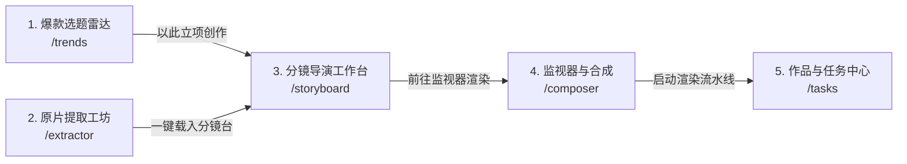

# AI Traffic Pipeline - 全功能概念原型设计说明

本目录包含 **AI Traffic Pipeline (PRO)** 的多页面模块化概念原型。

## 📍 原型文件入口
- **原型网页文件**：`原型设计/index.html` （或 `prototypes/index.html`）
- **如何打开预览**：
  - **方法 1（双击直开）**：在文件资源管理器中直接双击 `原型设计/index.html` 即可在任意浏览器中打开并交互体验。
  - **方法 2（静态服务）**：在终端运行 `python -m http.server 3000` 并访问 `http://localhost:3000/原型设计/`。

---

## 🧭 五大专属工作区与交互流

### 1. 🔥 爆款选题雷达 (Trends Radar)
- **定位**：全网多平台（抖音、B站、微博、知乎、小红书）实时官方榜单直连与跨端共振选题发现。
- **交互**：
  - 支持多平台（抖音官方热搜、B站实时热搜/日榜、微博热搜、知乎热榜、小红书精选）一键切换；
  - 信号（共振爆发预警、瞬时飙升、长尾常青）与赛道多维矩阵筛选；
  - 查看话题爆发指数、多平台共振登顶标签、爆款底层逻辑与分镜建议；
  - 点击卡片右下角「**以此立项创作 →**」，自动将该爆款选题带入分镜导演台并切换视图。

### 2. 🔗 原片提取工坊 (Video Extractor & Remaster)
- **定位**：对标短视频提取、Whisper 语音转写与 AI 爆款重构对照。
- **交互**：
  - 顶部粘贴抖音/B站/小红书分享链接，点击「⚡ 一键提取并仿写分镜」；
  - 左侧展示原片时长、转写出的完整纯文本；
  - 右侧展示 LLM 提炼出的「黄金 3 秒 Hook、底层机制、破局三原则、行动号召 CTA」四段式原创分镜；
  - 点击「**一键载入分镜台 →**」将原创结构直接装载进分镜工作台。

### 3. 🎬 分镜导演工作台 (Storyboard Studio)
- **定位**：影视级分镜脚本编排、AI 9:16 配图与台词润色。
- **交互**：
  - 宽敞卡片流布局，清晰查看每个镜头的序号、台词、关键词与 AI 生图 Prompt；
  - 镜头封面提供「🎨 AI 试生图」按钮，点击可实时模拟生成 9:16 竖屏电影级配图；
  - 支持快捷试听旁白语音合成音轨、删除/补充镜头。

### 4. 🎛️ 监视器与合成导出 (Video Composer & Monitor)
- **定位**：9:16 竖屏手机画框预览、排版选择与视听特效定制。
- **交互**：
  - 实时预览 9:16 手机画框；
  - 动态卡拉OK字幕动效预览（当前朗读词呈现高光放大金色动效）；
  - 3 种排版模版自由切换（沉浸全屏、上下分屏、磨砂金句）；
  - 9 款精选解说音色与情绪 BGM 选择；
  - 点击「🚀 启动全自动渲染流水线」自动开始后台合成并导出剪映 Draft。

### 5. 📂 作品与任务中心 (Task & Asset Center)
- **定位**：后台任务进度监控、历史短视频播放与剪映工程导出管理。
- **交互**：
  - 查看正在运行的渲染任务进度条与阶段状态；
  - 查看历史已生成视频，支持「🎬 剪映打开」与「💾 下载 MP4 / 字幕」。
